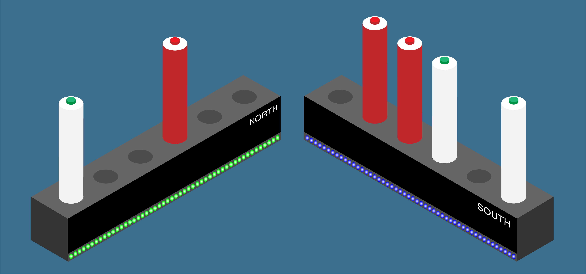
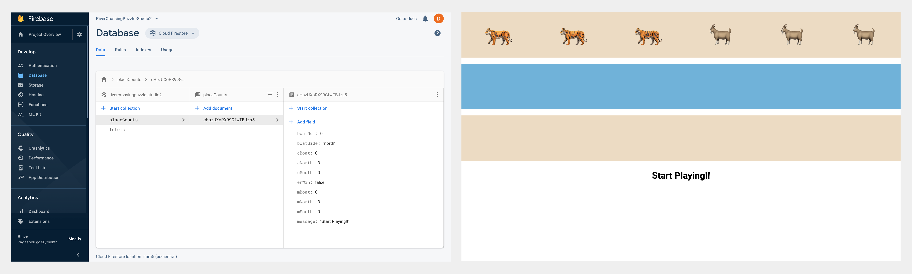

# river-crossing

These files contain the code written to play the River Crossing Puzzle game.

A river crossing puzzle is a type of puzzle in which the object is to carry items from one river bank to another. The difficulty of the puzzle arises from restrictions on how many items can be transported at the same time, or which items may be safely left together. 

An example can be found at this link: https://www.youtube.com/watch?v=hKX4RmVKlb4

This project attempted to recreate this puzzle in a form where it could be solved through physical interactive play.
The puzzle selected required 3 goats and 3 tigers to be transported without ever having more tigers than goats on a side.
The tigers and goats were represented by red and white totems respectively. A lighted button on the top of the totem was used to place them on the boat to move them to the opposite bank. If totems were moved without pressing the button the player would have to start the game from scratch. 

The totems are to be moved from base labeled north to that labelled south. A green light at the bottom of the base indicates that the boat is currently on that side. If the lights turn red then the goats have been eaten by the tigers and the game has to be restarted. 

Arduino was programmed with C to respond to changes in the totems and bases which then updates Firebase, which is a mobile and web application development platform. As totems were moved around physically updates would happen in Firebase to reflect current status. The logic of the puzzle was enforced through these status updates. A website shown through a screen near the game also reflected the changes in the physical puzzle for additional feedback.

